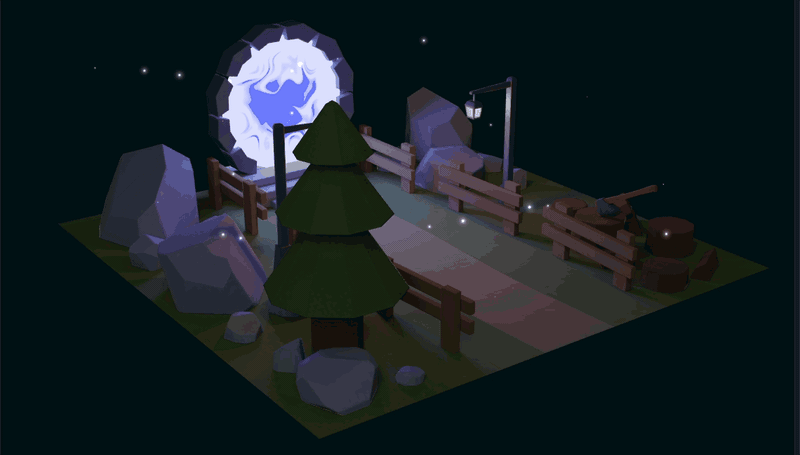

# threejs-portal

A `three.js` scene with a glowing portal and fireflies, built to test
texture baking and keeping a scene fast on a range of devices. Live at
[https://bsdev-threejs-portal.netlify.app/](https://bsdev-threejs-portal.netlify.app/).

## How it works

- **Baked lighting:** modelled and lit in Blender, with all lighting baked into
  one texture. The scene is drawn with unlit `MeshBasicMaterial`, so there are
  no real-time lights.
- **Portal:** a shader material animating layered Perlin noise between two
  colours.
- **Fireflies:** a `Points` cloud whose shader bobs each point and draws a soft
  glow, blended additively.
- **Debug panel:** add `#debug` to the URL for lil-gui controls over the fog,
  colours and firefly size.

## Scripts

Requires Node 22 (see `.nvmrc`).

| Script                    | Purpose                            |
| ------------------------- | ---------------------------------- |
| `dev`                     | Vite dev server on port 3000       |
| `build`                   | Production build into `dist/`      |
| `preview`                 | Serve the production build locally |
| `lint`                    | ESLint                             |
| `format` / `format:check` | Prettier write / check             |

## Credits

Code is MIT licensed (see [LICENSE](LICENSE)). Built while following the portal
lesson of [Three.js Journey](https://threejs-journey.com) by Bruno Simon. The
portal shader uses the classic Perlin noise from
[webgl-noise](https://github.com/stegu/webgl-noise) by Stefan Gustavson (MIT).
